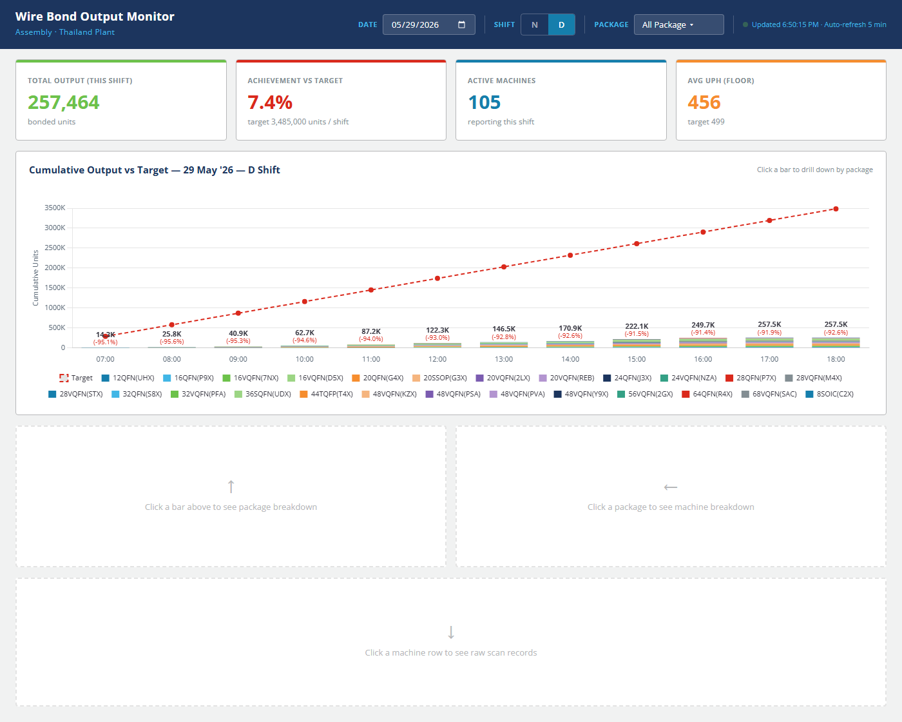

# Wire Bond Output Monitor (SvelteKit Edition)

> Real-time production dashboard for monitoring Wire Bond machine output at a semiconductor assembly plant. Built with **SvelteKit 5 + Svelte 5 Runes**, reads SQLite + Excel directly from the SvelteKit server. Drop-in replacement for the original Rust + Axum dashboard, re-skinned with the Microchip Industrial Light design system.



---

## Overview · ภาพรวม

ระบบ web dashboard สำหรับ Production Supervisor ใช้ติดตาม output ของเครื่อง Wire Bond แบบ real-time
เปรียบเทียบกับ target ของกะ และเจาะลึกถึงระดับ machine และ raw scan record

ข้อมูลทั้งหมดดึงมาจาก SQLite database (`central.db`) ของระบบ machine logging
และไฟล์แผนการผลิต `wb_plan.xlsx` โดย SvelteKit server เป็นคนอ่านตรง ๆ ผ่าน `better-sqlite3`
และ `xlsx` (sheetjs) ไม่ผ่าน backend อื่น

โปรเจคนี้คือ **port คอนเซ็ปต์ 1:1** จาก [WB_Dashboard](https://github.com/KookZ-code/WB_Output_Monitoring)
(Rust + Axum + plain HTML/JS) — ใช้ logic การคำนวณ baseline + carry-over heuristic เดิมทั้งหมด
แต่เขียนใหม่บน stack SvelteKit เพื่อ deploy บน IIS Windows Server ได้ง่ายขึ้น

---

## Features

- **Live KPIs** — Total bonded units · Achievement vs Target (สีเปลี่ยนตาม %) · Active machines · Average UPH
- **Cumulative chart** — Stacked bars per package + dashed target line + custom data labels (total + Δ% per hour)
- **Auto shift detection** — D shift 07:00–18:59 / N shift 19:00–06:59 (next day) เลือกอัตโนมัติตามเวลาจริง
- **Multi-select package filter** — Search + presets ("All Package", "All QFN")
- **3-level drill-down** with single-page state preservation:
  1. คลิกแท่ง → package breakdown ของชั่วโมงนั้น
  2. คลิก package → machine table + vs-target badge
  3. คลิก machine → raw scan records พร้อม delta highlight
- **Auto-refresh** ทุก 5 นาที + status indicator
- **Cutoff logic** — ซ่อนแท่งของชั่วโมงที่ยังมาไม่ถึงในกะปัจจุบัน
- **Carry-over detection** — heuristic ตรวจจับ lot ที่คาบกะเพื่อไม่นับซ้ำ
- **Per-variant UPH targets** — lookup จาก `package_mpc` ก่อน fallback ที่ base package name
- **IIS-ready** — ใช้ `sveltekit-adapter-iis` สร้าง `web.config` อัตโนมัติ
- **Microchip design system** — Open Sans, palette น้ำเงิน-ส้ม-เขียว-แดง สอดคล้อง corporate brand

---

## Architecture

```
┌──────────────────────┐
│  Browser             │  Svelte 5 Runes + Chart.js 4.x
└──────────┬───────────┘
           │ fetch /api/{summary,hourly,packages,machines,records}
           │
┌──────────▼───────────┐
│  SvelteKit server    │  +server.ts endpoints (Node.js)
│  (better-sqlite3 +   │
│   xlsx + chart.js)   │
└──────────┬───────────┘
           │
   ┌───────┴────────┐
   │                │
┌──▼───────┐  ┌─────▼──────┐
│central.db│  │wb_plan.xlsx│
└──────────┘  └────────────┘
  (DB_PATH)    (XLSX_PATH)
```

**API contract** (mirrors original Rust handlers):

| Method | Path                                       | Returns                              |
| ------ | ------------------------------------------ | ------------------------------------ |
| GET    | `/api/summary?date=&shift=&packages=`      | `SummaryResponse` — KPI card data    |
| GET    | `/api/hourly?date=&shift=&packages=`       | `HourlyResponse` — chart data        |
| GET    | `/api/packages?date=&shift=&hour=`         | `PackageRow[]` — drill-down 1        |
| GET    | `/api/machines?date=&shift=&hour=&package=`| `MachineRow[]` — drill-down 2        |
| GET    | `/api/records?date=&shift=&machine_id=&package=` | `RawRecord[]` — drill-down 3   |

---

## Tech Stack

| Layer       | Library                            | Why                                         |
| ----------- | ---------------------------------- | ------------------------------------------- |
| Framework   | SvelteKit 2.x + Svelte 5.x         | Modern reactivity (Runes), file-based routes |
| Language    | TypeScript (strict, no `any`)      | Type safety end-to-end                      |
| SQLite      | `better-sqlite3`                   | Synchronous, fastest Node SQLite client     |
| Excel       | `xlsx` (SheetJS)                   | Pure JS, no native deps                     |
| Charts      | `chart.js` 4.x                     | Custom plugin support, ported verbatim from original |
| Build       | Vite 6                             | Default for SvelteKit                       |
| Deploy      | `sveltekit-adapter-iis`            | Auto-generates `web.config` for IIS         |
| Design      | DESIGN.md (Microchip Industrial Light) | Single source of truth for tokens     |

---

## Prerequisites

- **Node.js 20+** ([download](https://nodejs.org/))
- **Windows** (target deployment is IIS) — works on macOS/Linux for development
- ไฟล์ข้อมูล 2 ไฟล์ที่ server ต้องอ่านได้:
  - `central.db` — SQLite ที่มี table `uph_records` (จาก machine logging system)
  - `wb_plan.xlsx` — แผนการผลิต UPH target + plan_per_shift ต่อ package

> Schema และที่มาของ `central.db` ดู [WB_Dashboard/data/README.md](https://github.com/KookZ-code/WB_Output_Monitoring/blob/main/data/README.md)

---

## Installation

### 1. Clone และติดตั้ง dependencies

```bash
git clone https://github.com/KookZ-code/WB_output_svelte.git
cd WB_output_svelte
npm install
```

### 2. Copy `.env.example` → `.env`

```bash
cp .env.example .env
```

### 3. แก้ `.env` ให้ชี้ไปที่ data ของคุณ

```env
# .env
ORIGIN=http://localhost:3000
BASE_PATH=
NODE_ENV=production
PORT=3000

# ⚠️ สำคัญ — แก้ 2 บรรทัดนี้ให้ตรงกับเครื่องของคุณ
DB_PATH=./data/central.db
XLSX_PATH=./data/wb_plan.xlsx
```

ทางเลือกที่นิยม:
- **Local dev:** copy ไฟล์ไปไว้ที่ `./data/` ของโปรเจค
- **Network share:** `DB_PATH=//file-server/share/wb/central.db`
- **Path เฉพาะของเครื่อง:** `DB_PATH=D:/wb-data/central.db`

> ใช้ `/` (forward slash) ได้บน Windows — Node.js handle ให้

### 4. Verify

```bash
npm run check    # type-check ทั้ง project ต้องผ่าน 0 errors / 0 warnings
```

---

## Usage

### Development

```bash
npm run dev
```

เปิด `http://localhost:5173/` (หรือ port อื่นถ้า 5173 ถูกใช้ — ดู log ตอนรัน)

ถ้าตั้ง `BASE_PATH=/myapp` ใน `.env` → URL จะเป็น `http://localhost:5173/myapp/`

### แชร์ dev server บน LAN (ชั่วคราว)

```bash
npm run dev -- --host
```

จะแสดง URL Network ที่คนใน LAN เดียวกันเข้ามาดูได้ (ต้อง allow firewall port 5173)

### Production build

```bash
npm run build
npm run preview    # preview production locally ก่อน deploy
```

ผลลัพธ์ใน `build/` พร้อม `web.config` สำหรับ IIS

### Useful scripts

```bash
npm run dev        # dev server (vite)
npm run build      # production build
npm run preview    # preview production
npm run check      # svelte-check + tsc
npm run check:watch
npm run lint       # prettier + eslint check
npm run format     # prettier write
npm run test       # vitest
npm run test:e2e   # playwright
```

---

## Deployment to IIS

โปรเจคออกแบบมาเพื่อ deploy บน **IIS Windows Server** เป็นหลัก

### บนเครื่อง server (ครั้งเดียว)

1. ติดตั้ง **Node.js 20+** เวอร์ชันเดียวกับ dev
2. ติดตั้ง **iisnode** ([github.com/Azure/iisnode](https://github.com/Azure/iisnode))
3. ติดตั้ง **IIS URL Rewrite Module** ([iis.net](https://www.iis.net/downloads/microsoft/url-rewrite))
4. สร้าง IIS Application ใต้ default site (เช่น `wbmonitor`)

### Deploy

```powershell
# 1. Build บนเครื่อง dev
npm run build

# 2. Copy ไฟล์ขึ้น server
$dst = "\\<server>\C$\inetpub\wwwroot\wbmonitor"
Copy-Item -Recurse -Force .\build\* $dst
Copy-Item -Force .\package.json $dst
Copy-Item -Force .\.env $dst   # อย่าลืมแก้ DB_PATH/XLSX_PATH ในนี้ก่อน

# 3. ติดตั้ง production deps บน server
ssh <server> "cd C:\inetpub\wwwroot\wbmonitor && npm install --production"

# 4. Restart IIS
ssh <server> "iisreset"
```

### `.env` บน server ต้องชี้ไปที่ DB ที่ server เข้าถึงได้

```env
ORIGIN=http://<server-name>
BASE_PATH=/wbmonitor
DB_PATH=\\file-server\share\wb\central.db
XLSX_PATH=\\file-server\share\wb\wb_plan.xlsx
```

> ระวัง: IIS Application Pool user ต้องมีสิทธิ์อ่าน path ของ DB และ XLSX

---

## Project Structure

```
WB_output_svelte/
├── src/
│   ├── app.css                          # Global tokens — Microchip design system
│   ├── app.html                         # SvelteKit shell
│   ├── lib/
│   │   ├── components/                  # Svelte UI components
│   │   │   ├── DashboardHeader.svelte   # Title + filters (date/shift/pkg)
│   │   │   ├── PackageDropdown.svelte   # Multi-select w/ search + presets
│   │   │   ├── KpiCards.svelte          # 4 KPI cards (color-coded)
│   │   │   ├── MainChart.svelte         # Chart.js stacked bar + target line
│   │   │   ├── PackagePanel.svelte      # Drill 1 — package breakdown
│   │   │   ├── MachineTable.svelte      # Drill 2 — machines
│   │   │   └── RecordsTable.svelte      # Drill 3 — raw scan records
│   │   ├── server/                      # SERVER-ONLY (won't reach client)
│   │   │   ├── config.ts                # Env reader
│   │   │   ├── db.ts                    # better-sqlite3 connection
│   │   │   ├── shift.ts                 # Shift window calc
│   │   │   ├── excel.ts                 # XLSX plan parser + name normalize
│   │   │   ├── plan-cache.ts            # Lazy singleton w/ mtime check
│   │   │   ├── handler-utils.ts         # Shared endpoint helpers
│   │   │   └── queries/
│   │   │       ├── summary.ts           # query_summary
│   │   │       ├── hourly.ts            # query_hourly (most complex)
│   │   │       ├── packages.ts          # query_packages
│   │   │       ├── machines.ts          # query_machines
│   │   │       └── records.ts           # query_records (LAG window)
│   │   ├── stores/
│   │   │   └── dashboard.svelte.ts      # $state runes — UI state
│   │   ├── types/
│   │   │   ├── index.ts                 # Generic API types
│   │   │   └── dashboard.ts             # Domain types (mirrors Rust models.rs)
│   │   └── utils/
│   │       ├── api.ts                   # Generic typed fetch wrapper
│   │       └── format.ts                # Number/percent formatters
│   └── routes/
│       ├── +layout.svelte               # Loads app.css
│       ├── +page.svelte                 # Dashboard orchestrator
│       └── api/
│           ├── summary/+server.ts
│           ├── hourly/+server.ts
│           ├── packages/+server.ts
│           ├── machines/+server.ts
│           └── records/+server.ts
├── docs/
│   ├── plan/
│   │   └── wb-dashboard-port.md         # Implementation plan
│   └── user-guide/
│       ├── index.html                   # Self-contained HTML guide for supervisors
│       └── screenshots/                 # Annotated dashboard screenshots
├── DESIGN.md                            # Microchip design system tokens
├── CLAUDE.md                            # Engineering guidelines for AI agents
├── LICENSE                              # MIT
├── README.md                            # This file
├── .env.example                         # Template — copy to .env
├── .gitignore
├── package.json
├── svelte.config.js                     # SvelteKit + IIS adapter config
├── tsconfig.json
└── vite.config.ts
```

---

## Domain Logic Notes

### Shift definitions

```
D shift "YYYY-MM-DD" = 07:00–18:59 same calendar date
N shift "YYYY-MM-DD" = 19:00 (previous day) → 06:59 (this day)
```

### Production calculation

`bonded_unit` คือ **cumulative counter ต่อ (machine, lot)** — ดังนั้นการคำนวณ
production ต่อกะใช้ `MAX(bonded_unit) - baseline`:

1. **มี pre-shift record** → baseline = ค่า `bonded_unit` ล่าสุดก่อน shift_start
2. **ไม่มี pre-shift record** → ใช้ carry-over heuristic:
   ```
   implied_uph = first_scan.bonded_unit ÷ hours_since_shift_start
   ถ้า implied_uph > first_scan.uph × 2  → carry-over (baseline = first_scan.bonded)
   ไม่ใช่                              → lot ใหม่จริง (baseline = 0)
   ```
3. **Negative-delta clamp** — `MAX(0, max - baseline)` เพราะ void/correction
   อาจทำให้ pre-shift สูงกว่า max ในกะ

### Package name resolution

| Layer            | ที่ไหน              | ตัวอย่าง          |
| ---------------- | ------------------- | ----------------- |
| Display key      | API responses, UI   | `36SQFN(UDX)`     |
| `package_mpc`    | DB (newer rows)     | `36SQFN(UDX)`     |
| Derived from `mpc` | DB (legacy)       | `package + (SUBSTR(mpc, 7, 3))` |
| Excel plan name  | `wb_plan.xlsx`      | `36L SQFN 6X6(UDX)` |

Per-variant UPH lookup: `mpcPlanMap` ก่อน → fallback `planMap` (base name)

---

## User Guide

คู่มือการใช้งานสำหรับ Production Supervisor พร้อม screenshot อยู่ที่
[`docs/user-guide/User guide for supervisor.html`](docs/user-guide/User%20guide%20for%20supervisor.html)
— เปิดด้วย browser ได้เลย หรือพิมพ์เป็น PDF ส่งให้ทีม

หัวข้อในคู่มือ:
1. ภาพรวมหน้า dashboard
2. ส่วนหัวจอ (filters)
3. การ์ด KPI 4 ตัว
4. กราฟหลัก (วิธีอ่าน + tooltip)
5. Drill-down 3 ระดับ (step-by-step)
6. ความหมายของสี
7. Workflow แนะนำ (ต้นกะ / กลางกะ / ปิดกะ)
8. Tips
9. FAQ

---

## Development Notes

### Behavioral guidelines

ดู [CLAUDE.md](CLAUDE.md) — ระเบียบสำหรับ AI agents และมนุษย์ที่ทำงานกับ codebase นี้:
- ห้ามใช้ `any`
- ห้าม fetch ใน component (ใช้ `$lib/utils/api.ts`)
- ห้าม hardcode URLs/secrets
- ทุก visual value มาจาก `DESIGN.md` tokens

### Known gotchas

- **Svelte 5 + Chart.js:** Reactive proxies break `Object.defineProperty`. ต้อง clone array ก่อนส่งให้ Chart.js (`[...arr]`) — ดู `MainChart.svelte`
- **better-sqlite3 numbered placeholders:** `?N` ไม่ accept positional binding ใช้ named (`@start`, `@end`) แทน
- **xlsx + Vite SSR:** `XLSX.readFile()` พัง — ใช้ `XLSX.read(readFileSync(path))` แทน

### Testing

ตอนนี้ยังไม่มี test suite — `npm run test` (vitest) และ `npm run test:e2e` (playwright) เตรียมไว้แล้วแต่ยังไม่ได้เขียน

---

## License

[MIT](LICENSE) — Free to use, modify, and distribute. ไม่มี warranty

---

## Acknowledgements

- **WB Dashboard original** ([KookZ-code/WB_Output_Monitoring](https://github.com/KookZ-code/WB_Output_Monitoring)) — Rust + Axum implementation นี้ port คอนเซ็ปต์มาทั้งดุ้น
- **Microchip Industrial Light** design system — สีและ typography
- **SvelteKit** — production-grade web framework

Built for internal use at a semiconductor assembly facility in Thailand.
